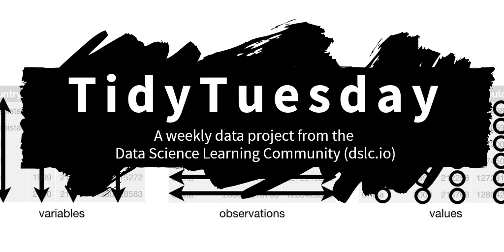

## 

:::::: {.columns .v-center}
::: {.column width="40%"}
{fig-align="center" width="80%"}
:::

:::: {.column width="60%"}
::: {.incremental}
-   Club and professional forum to learn/retool
-   Global network of chapters
-   Workshops vary from beginning to advanced
-   Polyglot (Python, Julia, R, etc.)
-   We follow the [PyData Code of Conduct](https://pydata.org/code-of-conduct/)
-   Join at [meetup.com/pydata-northern-utah](https://www.meetup.com/pydata-northern-utah/)
:::
::::
::::::

## 

:::: {.columns .v-center}

::: {.column width="40%"}
{fig-align="center"}
:::

::: {.column width="60%"}
::: {.incremental}
- Weekly social data project
- Opportunity to practice, add to portfolios
- New project provided every week
- Share with *#TidyTuesday #PydyTuesday*
- Named after the "tidy" data philosophy
- Get started at [tidytues.day](https://tidytues.day)
:::
:::

::::

## Bird sightings at sea

This week we're exploring [Bird Sightings at Sea](https://github.com/rfordatascience/tidytuesday/blob/main/data/2026/2026-04-14/readme.md)! The data this week comes from Te Papa Tongarewa, The Museum of New Zealand. It consists of log book entries of bird sightings at sea near New Zealand, from 1969 to 1990.

```{python}
#| eval: true
#| code-line-numbers: "|1-2|4-7|9-12"

import polars as pl
import seaborn.objects as so

beaufort_scale_url = 'https://raw.githubusercontent.com/rfordatascience/tidytuesday/main/data/2026/2026-04-14/beaufort_scale.csv'
birds_url = 'https://raw.githubusercontent.com/rfordatascience/tidytuesday/main/data/2026/2026-04-14/birds.csv'
sea_states_url = 'https://raw.githubusercontent.com/rfordatascience/tidytuesday/main/data/2026/2026-04-14/sea_states.csv'
ships_url = 'https://raw.githubusercontent.com/rfordatascience/tidytuesday/main/data/2026/2026-04-14/ships.csv'

beaufort_scale = pl.read_csv(beaufort_scale_url, null_values = ['NA'])
birds = pl.read_csv(birds_url, null_values = ['NA'])
sea_states = pl.read_csv(sea_states_url, null_values = ['NA'])
ships = pl.read_csv(ships_url, null_values = ['NA'])
```

## Bird sightings at sea

```{python}
#| eval: true
#| output-location: slide
#| code-line-numbers: "|2-7|9-11"

# Which 10 species of bird are observed most often?
species_count = (birds
  .group_by(pl.col(['species_common_name']))
  .agg(n = pl.len())
  .sort(pl.col('n'), descending = True)
  .slice(0, 10)
)

(so.Plot(species_count, x = 'n', y = 'species_common_name')
  .add(so.Bar())
)
```

## {background-color="#288DC2"}

::: {.v-center}
{fig-align="center"}
:::

